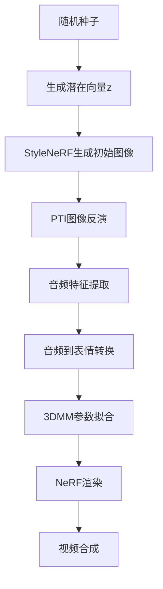
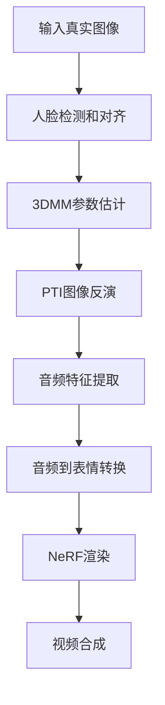
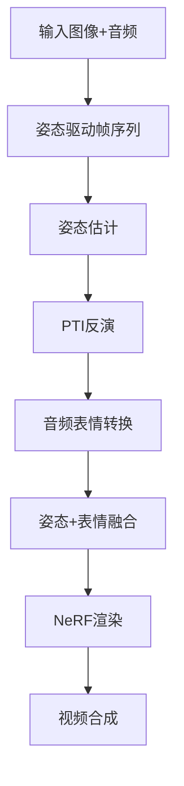
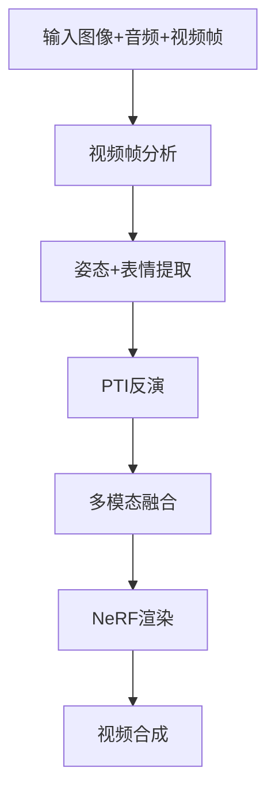

让我分析NeRFFaceSpeech项目中各个推理功能的具体流程。首先查看主要的推理脚本和流程。


[4 tools called]

现在让我查看音频处理工具函数来了解完整的推理流程：


[2 tools called]

基于我对NeRFFaceSpeech项目代码的深入分析，以下是各个推理功能的具体流程：

## 🎬 NeRFFaceSpeech 推理功能详细流程

### 1. **从潜在空间生成** (`main_NeRFFaceSpeech_audio_driven_from_z.py`)

#### 流程概述


#### 详细步骤
1. **初始化阶段**
   - 设置随机种子
   - 加载StyleNeRF预训练模型
   - 从随机噪声z生成初始人脸图像

2. **图像处理阶段**
   - 使用BiSeNet进行语义分割
   - 加载Deep3D模型进行3DMM参数估计
   - 提取初始姿态和表情参数

3. **PTI反演阶段**
   - 使用Pivotal Tuning Inversion将生成图像反演到潜在空间
   - 保存反演后的生成器和潜在代码

4. **音频处理阶段**
   - 加载SadTalker音频到表情模型
   - 提取音频Mel频谱特征
   - 将音频特征转换为表情参数

5. **渲染阶段**
   - 逐帧生成NeRF渲染
   - 使用LipaintNet进行嘴部区域修复
   - 应用时间平滑处理

### 2. **从真实图像生成** (`main_NeRFFaceSpeech_audio_driven_from_image.py`)

#### 流程概述


#### 详细步骤
1. **图像预处理**
   - 加载输入的真实人脸图像
   - 调整图像尺寸到224x224
   - 进行人脸检测和关键点提取

2. **3D重建**
   - 使用Deep3D模型估计3DMM参数
   - 提取姿态、表情、形状参数
   - 生成3D人脸网格

3. **PTI反演**
   - 将真实图像反演到StyleNeRF潜在空间
   - 训练2000次迭代优化生成器
   - 保存优化后的模型参数

4. **音频驱动**
   - 处理音频文件，提取Mel频谱
   - 使用audio2exp模型预测表情参数
   - 应用表情缩放和时间平滑

5. **NeRF渲染**
   - 逐帧渲染3D说话人头
   - 使用语义分割进行区域控制
   - 应用嘴部修复和背景冻结

### 3. **给定姿态生成** (`main_NeRFFaceSpeech_audio_driven_w_given_poses.py`)

#### 流程概述


#### 详细步骤
1. **姿态处理**
   - 加载姿态驱动帧序列
   - 使用Deep3D模型估计每帧的姿态
   - 处理姿态检测失败的情况

2. **多模态融合**
   - 结合音频驱动的表情参数
   - 融合姿态驱动的头部运动
   - 保持身份特征一致性

3. **渲染优化**
   - 动态调整相机参数
   - 优化NeRF渲染质量
   - 处理姿态变化时的几何变形

### 4. **视频驱动生成** (`main_NeRFFaceSpeech_video_driven.py`)

#### 流程概述


#### 详细步骤
1. **视频分析**
   - 逐帧分析驱动视频
   - 提取每帧的姿态和表情参数
   - 处理视频帧的时序信息

2. **参数融合**
   - 结合音频表情参数
   - 融合视频姿态参数
   - 保持时序一致性

3. **高级渲染**
   - 使用更复杂的NeRF渲染
   - 处理复杂的头部运动
   - 优化视频质量

## 🔧 核心技术组件

### 1. **音频处理流程**
```python
# 音频特征提取
frame_mel = audio_mel_load_sadtalker(test_data, device)

# 音频到表情转换
gt_exp_param_eval = audio2exp_model(frame_mel[:,i:i+1,:,:], ref_exp_coeffs[:1], val_ratio)

# 表情参数处理
ref_full_coeff[:, 80: 144] = frame_ref_exp_coeffs
```

### 2. **3DMM参数处理**
```python
# 3DMM参数拟合
fitted_coeffs = fit_3dmm(outdir)

# 3D渲染
_, _, face_proj_moved, _ = render_3dmm(Deep3Dmodel, img_tesnor_224_prc, ref_full_coeff, get_lm=True)

# 坐标变换
scaled_face_proj_moved = scale_and_shift_coordinates(face_proj_moved[:, ::4,:])
```

### 3. **NeRF渲染流程**
```python
# NeRF渲染
i_frame = G2(styles=torch.cat((ws_nerf, w_frame_2d), dim=1), 
             truncation_psi=truncation_psi, 
             noise_mode=noise_mode, 
             **synthesis_kwargs)

# 嘴部修复
w_exp_transfered = exp_transfer_decoder(ws[:,0,:], frame_ref_exp_coeffs)
inpaint_out = G2(styles=torch.cat((w_exp_transfered, ws[:,10:,:]), dim=1), **synthesis_kwargs)
```

### 4. **时间平滑处理**
```python
# 时间平滑
smoother = TemporalSmoothing(buffer_size=7)
mouse_mask = smoother.smooth(mouse_mask)

# 表情平滑
ref_exp_coeffs[:1] = root_value * avg_weight + gt_exp_param_eval.squeeze(-1) * (1-avg_weight)
```

## 🎯 关键特性

### 1. **多模态融合**
- 音频特征 + 视觉特征
- 表情参数 + 姿态参数
- 时序信息 + 空间信息

### 2. **质量优化**
- PTI反演提升身份保持
- LipaintNet嘴部修复
- 时间平滑减少抖动
- 语义分割精确控制

### 3. **实时处理**
- 批量音频特征提取
- 并行NeRF渲染
- 内存优化管理

### 4. **鲁棒性**
- 姿态检测失败处理
- 音频质量自适应
- 多尺度渲染支持

这些推理流程展现了NeRFFaceSpeech在音频驱动3D说话人头合成方面的技术深度和复杂性，每个模块都经过精心设计以实现高质量的生成效果。