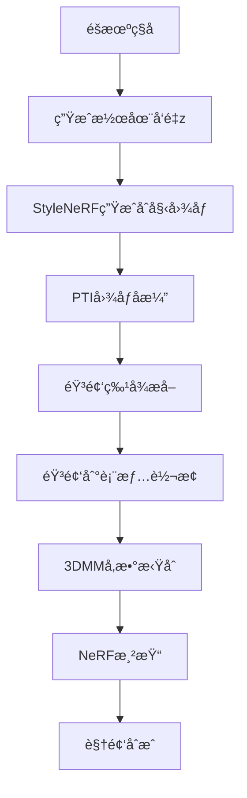
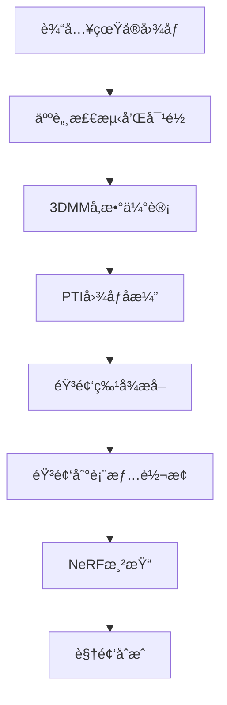
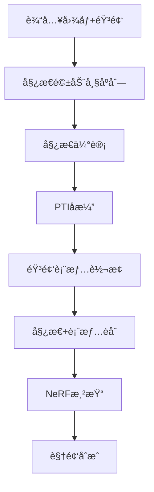
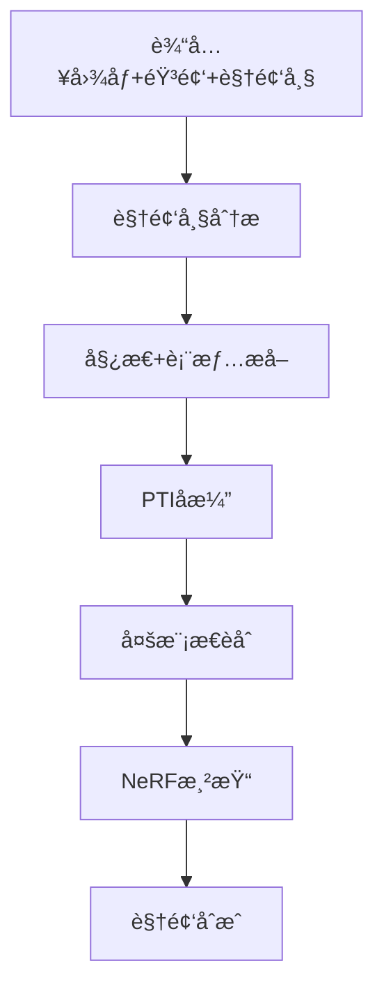

让我分æNeRFFaceSpeech项目中å„个æ¨ç†åŠŸèƒ½çš„具体æµç¨‹ã€‚首先查看主è¦çš„æ¨ç†è„šæœ¬å’Œæµç¨‹ã€‚


[4 tools called]

ç°åœ¨è®©æˆ‘查看音频处ç†å·¥å…·å‡½æ•°æ¥äº†è§£å®Œæ•´çš„æ¨ç†æµç¨‹ï¼š


[2 tools called]

基äºæˆ‘对NeRFFaceSpeech项目代ç çš„深入分æ，以下是å„个æ¨ç†åŠŸèƒ½çš„具体æµç¨‹ï¼š

## 🬠NeRFFaceSpeech æ¨ç†åŠŸèƒ½è¯¦ç»†æµç¨‹

### 1. **ä»æ½œåœ¨ç©ºé—´ç”Ÿæˆ** (`main_NeRFFaceSpeech_audio_driven_from_z.py`)

#### æµç¨‹æ¦‚è¿°


#### 详细步骤
1. **åˆå§‹åŒ–阶段**
   - 设置éšæœºç§å­
   - 加载StyleNeRF预训练模å‹
   - ä»éšæœºå™ªå£°z生æˆåˆå§‹äººè„¸å›¾åƒ

2. **图åƒå¤„ç†é˜¶æ®µ**
   - 使用BiSeNet进行语义分割
   - 加载Deep3D模å‹è¿›è¡Œ3DMMå‚数估计
   - æå–åˆå§‹å§¿æ€å’Œè¡¨æƒ…å‚æ•°

3. **PTIå演阶段**
   - 使用Pivotal Tuning Inversion将生æˆå›¾åƒå演到潜在空间
   - ä¿å­˜åæ¼”å的生æˆå™¨å’Œæ½œåœ¨ä»£ç 

4. **音频处ç†é˜¶æ®µ**
   - 加载SadTalker音频到表情模å‹
   - æå–音频Mel频谱特å¾
   - 将音频特å¾è½¬æ¢ä¸ºè¡¨æƒ…å‚æ•°

5. **渲染阶段**
   - é€å¸§ç”ŸæˆNeRF渲染
   - 使用LipaintNet进行嘴部区域修å¤
   - 应用时间平滑处ç†

### 2. **ä»çœŸå®å›¾åƒç”Ÿæˆ** (`main_NeRFFaceSpeech_audio_driven_from_image.py`)

#### æµç¨‹æ¦‚è¿°


#### 详细步骤
1. **图åƒé¢„处ç†**
   - 加载输入的真å®äººè„¸å›¾åƒ
   - 调整图åƒå°ºå¯¸åˆ°224x224
   - 进行人脸检测和关键点æå–

2. **3Dé‡å»º**
   - 使用Deep3D模å‹ä¼°è®¡3DMMå‚æ•°
   - æå–姿æ€ã€è¡¨æƒ…ã€å½¢çŠ¶å‚æ•°
   - 生æˆ3D人脸网格

3. **PTIåæ¼”**
   - 将真å®å›¾åƒå演到StyleNeRF潜在空间
   - 训练2000次迭代优化生æˆå™¨
   - ä¿å­˜ä¼˜åŒ–å的模å‹å‚æ•°

4. **音频驱动**
   - 处ç†éŸ³é¢‘文件，æå–Mel频谱
   - 使用audio2exp模å‹é¢„测表情å‚æ•°
   - 应用表情缩放和时间平滑

5. **NeRF渲染**
   - é€å¸§æ¸²æŸ“3D说è¯äººå¤´
   - 使用语义分割进行区域æ§åˆ¶
   - 应用嘴部修å¤å’ŒèƒŒæ™¯å†»ç»“

### 3. **给定姿æ€ç”Ÿæˆ** (`main_NeRFFaceSpeech_audio_driven_w_given_poses.py`)

#### æµç¨‹æ¦‚è¿°


#### 详细步骤
1. **姿æ€å¤„ç†**
   - 加载姿æ€é©±åŠ¨å¸§åºåˆ—
   - 使用Deep3D模å‹ä¼°è®¡æ¯å¸§çš„姿æ€
   - 处ç†å§¿æ€æ£€æµ‹å¤±è´¥çš„情况

2. **多模æ€èåˆ**
   - 结åˆéŸ³é¢‘驱动的表情å‚æ•°
   - èåˆå§¿æ€é©±åŠ¨çš„头部è¿åŠ¨
   - ä¿æŒèº«ä»½ç‰¹å¾ä¸€è‡´æ€§

3. **渲染优化**
   - 动æ€è°ƒæ•´ç›¸æœºå‚æ•°
   - 优化NeRF渲染质é‡
   - 处ç†å§¿æ€å˜åŒ–时的几何å˜å½¢

### 4. **视频驱动生æˆ** (`main_NeRFFaceSpeech_video_driven.py`)

#### æµç¨‹æ¦‚è¿°


#### 详细步骤
1. **视频分æ**
   - é€å¸§åˆ†æ驱动视频
   - æå–æ¯å¸§çš„姿æ€å’Œè¡¨æƒ…å‚æ•°
   - 处ç†è§†é¢‘帧的时åºä¿¡æ¯

2. **å‚æ•°èåˆ**
   - 结åˆéŸ³é¢‘表情å‚æ•°
   - èåˆè§†é¢‘姿æ€å‚æ•°
   - ä¿æŒæ—¶åºä¸€è‡´æ€§

3. **高级渲染**
   - 使用更å¤æ‚çš„NeRF渲染
   - 处ç†å¤æ‚的头部è¿åŠ¨
   - 优化视频质é‡

## 🔧 核心技术组件

### 1. **音频处ç†æµç¨‹**
```python
# 音频特å¾æå–
frame_mel = audio_mel_load_sadtalker(test_data, device)

# 音频到表情转æ¢
gt_exp_param_eval = audio2exp_model(frame_mel[:,i:i+1,:,:], ref_exp_coeffs[:1], val_ratio)

# 表情å‚数处ç†
ref_full_coeff[:, 80: 144] = frame_ref_exp_coeffs
```

### 2. **3DMMå‚数处ç†**
```python
# 3DMMå‚æ•°æ‹Ÿåˆ
fitted_coeffs = fit_3dmm(outdir)

# 3D渲染
_, _, face_proj_moved, _ = render_3dmm(Deep3Dmodel, img_tesnor_224_prc, ref_full_coeff, get_lm=True)

# åæ ‡å˜æ¢
scaled_face_proj_moved = scale_and_shift_coordinates(face_proj_moved[:, ::4,:])
```

### 3. **NeRF渲染æµç¨‹**
```python
# NeRF渲染
i_frame = G2(styles=torch.cat((ws_nerf, w_frame_2d), dim=1), 
             truncation_psi=truncation_psi, 
             noise_mode=noise_mode, 
             **synthesis_kwargs)

# 嘴部修å¤
w_exp_transfered = exp_transfer_decoder(ws[:,0,:], frame_ref_exp_coeffs)
inpaint_out = G2(styles=torch.cat((w_exp_transfered, ws[:,10:,:]), dim=1), **synthesis_kwargs)
```

### 4. **时间平滑处ç†**
```python
# 时间平滑
smoother = TemporalSmoothing(buffer_size=7)
mouse_mask = smoother.smooth(mouse_mask)

# 表情平滑
ref_exp_coeffs[:1] = root_value * avg_weight + gt_exp_param_eval.squeeze(-1) * (1-avg_weight)
```

## 🯠关键特性

### 1. **多模æ€èåˆ**
- éŸ³é¢‘ç‰¹å¾ + 视觉特å¾
- 表情å‚æ•° + 姿æ€å‚æ•°
- æ—¶åºä¿¡æ¯ + 空间信æ¯

### 2. **è´¨é‡ä¼˜åŒ–**
- PTIåæ¼”æå‡èº«ä»½ä¿æŒ
- LipaintNet嘴部修å¤
- 时间平滑å‡å°‘抖动
- 语义分割精确æ§åˆ¶

### 3. **å®æ—¶å¤„ç†**
- 批é‡éŸ³é¢‘特å¾æå–
- 并行NeRF渲染
- 内存优化管ç†

### 4. **é²æ£’性**
- 姿æ€æ£€æµ‹å¤±è´¥å¤„ç†
- 音频质é‡è‡ªé€‚应
- 多尺度渲染支æŒ

这些æ¨ç†æµç¨‹å±•ç°äº†NeRFFaceSpeech在音频驱动3D说è¯äººå¤´åˆæˆæ–¹é¢çš„技术深度和å¤æ‚性，æ¯ä¸ªæ¨¡å—都ç»è¿‡ç²¾å¿ƒè®¾è®¡ä»¥å®ç°é«˜è´¨é‡çš„生æˆæ•ˆæœã€‚