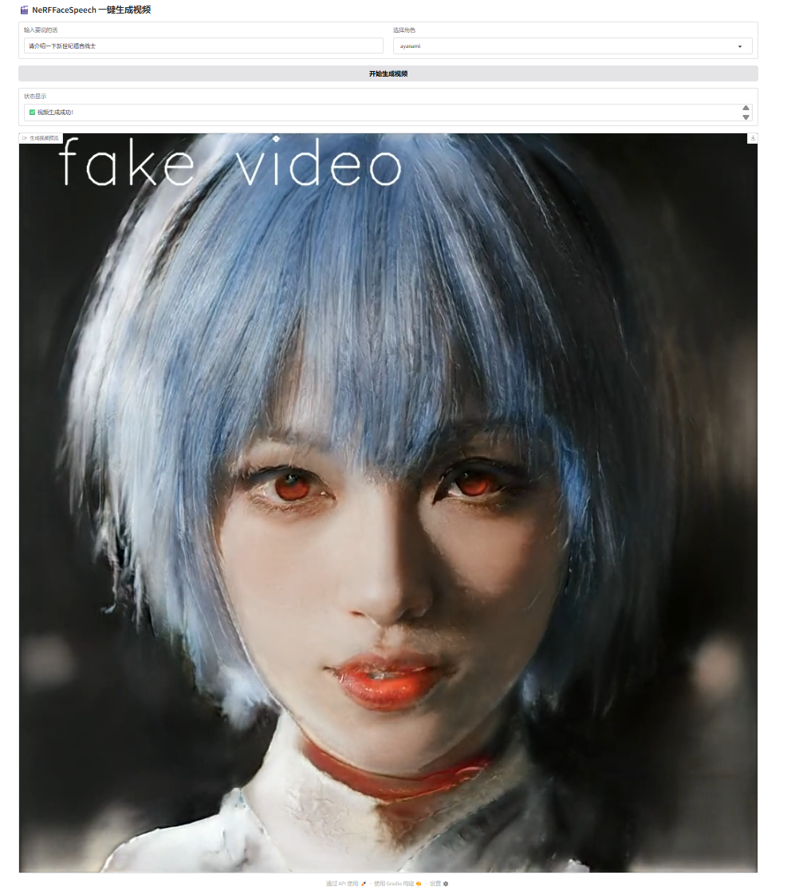

<span style="color:#ff0000;">由于AutoDL不提供http和https服务，前端只能部署在服务器上面了</span>
### 1 服务器使用方法

#### 1.1 服务器连接

可以登录我的`AutoDL` 子账号：
- 登录用户名：keyword2333@a7cc5f8b5a09a533
- 密码：35yfGqGl0Pve

其中”重庆A区 / 197机“是目前项目内容版本最新的服务器，确保余额足够的情况下进行开机（如果余额不足可以让我充值最后一起AA）。

该实例的ssh为：ssh -p 28635 root@connect.cqa1.seetacloud.com
密码为：t1EEYttLGIVC

#### 1.2 准备工作

目前按部署了完整的后端和简化的gradio前端

为了保证运行过程不出错，在后端终端启动服务器前前请执行以下命令

```bash
export PIP_INDEX_URL=https://pypi.tuna.tsinghua.edu.cn/simple 

export TORCH_HOME=/root/autodl-tmp/weights

export HF_ENDPOINT=https://hf-mirror.com

export HF_HOME=/root/autodl-tmp/Hugging_Face
```

#### 1.3 后端接口&启动

后端接收两个属性:

```json
{
  "text": "string",
  "character": "string"
}
```
- `text` 为LLM输入（对话的内容）
- `character` 为生成视频的角色，目前只有 `ayanami` 和 `Aerith` 两个选项。

-------------------------------------
请按照以下步骤启动服务器：
- 在 `base` 环境下，依次执行

```bash
cd ./autodl-tmp/fastapi_server
```

```bash
uvicorn main:app --reload --host 0.0.0.0
```

- 请等待几秒，如果没有报错，就可以去下面这个地址访问后端：

```txt
http://localhost:8000/docs
```

--------------------------------------------

后端的 `generate_video` 可以进行 `json` 级别的输入和输出。可以做一个简单测验

后端的返回格式为：
```json
{
   "success": BOOL,
   "video_url": video_url
}
```
- 其中 `video_url` 为生成视频的地址。

#### 1.4 前端启动

在保证后端运行正常的情况下，重新打开一个终端

按照以下步骤开启前端：
- 在base环境下，依次执行
```bash
cd ./autodl-tmp/fastapi_server
```
```bash
python simple_web.py
```
- 没有报错就可以在这个地址访问前端
```txt
http://localhost:7860/
```

-------------------------

前端可以输入 `text` 和选择角色，需要等待五分钟以上才能生成视频。



### 2 训练的方法

不建议使用这个方法，因为项目作者给出的方法里面，推理的过程就是在训练了，我的训练过程是基于 `StyleNerf` 的权重迁移学习。但是实际上作者给出的`PTI`方法已经是 SOTA，为了保证项目的完整性还是将训练过程补全吧。

先考虑的是局部权重微调，`StyleNerf`项目给了两个方式（projector 和 inversion），都是针对前景 latent 的微调，而inversion在此基础上多了背景latent的微调。PTI则是直接把图片通过神经网络提取出参数，再注入GAN的权重，它其实是把这张目标图片当作一个只有一个样本的训练集，对生成器进行了一次短暂的反向传播训练。

| 维度           | projector.py      | inversion.py     | PTI           |
| ------------ | ----------------- | ---------------- | ------------- |
| 初始化          | w_avg             | Encoder 或 w_avg  | Encoder       |
| 优化 latent    | ✅ w + noise       | ✅ w + 背景 latents | ✅ w (阶段2)     |
| 优化 Generator | ❌                 | ❌                | ✅ 微调 G (阶段3)  |
| 感知损失         | LPIPS (StyleGAN2) | VGG16 多层         | LPIPS         |
| 像素损失         | ❌                 | ✅ MSE            | ❌ (通常)        |
| 收敛速度         | 慢（~1000步）         | 快（有 encoder）     | 中等（1000+350步） |
| 重建质量         | ⭐⭐⭐               | ⭐⭐⭐⭐             | ⭐⭐⭐⭐⭐ 最好      |
| 存储成本         | ~4KB (w)          | ~8KB (w + 背景)    | ~200MB (微调的G) |
| 编辑灵活性        | 好                 | 更好（多 latents）    | 最好（但G不通用）     |

projector和inversion前两者效果都微乎其微（下手），而且效果图太恐怖了我就不放上来了。故选择直接微调ffhq_1024.pkl。
通过构建重复图像数据集，使得训练后的模型产生过拟合现象，所以一次微调只适合一个人像生成。

-------------------------------------
由于环境比较特殊，项目运行环境不支持很新的显卡，所以我新开了一个实例”佛山区 / 066机“。GPU充足的时候可以自行开机使用。

连接服务器之后执行以下命令：
```
cd ./autodl-tmp/StyleNerf
conda activate stylenerf
```

可以进行微调
```
python test_checkpoint.py \ 
outdir=./overfit_output \ 
data=/root/autodl-tmp/StyleNeRF/single_image_dataset \ 
model=style_ffhq_ae_basic \ 
resume=/root/autodl-tmp/StyleNeRF/pretrained/ffhq_1024.pkl \ 
aug=noaug \ 
mirror=False \ 
snap=5 \ 
imgsnap=1
```

其中 `paper1024` 里面有训练参数，直接使用也可以，但是最好把`kimg` 改小一些（50左右），否则以当前显卡需要训练几个月；或者在训练中途取出`snapshot` 观察效果。不要使用其他model配置，这个是调试后符合 `ffhq.pkl` 结构的模型参数了，其他都不符合。

训练好的 `.pkl` 文件可以取出，放到后端的 `pretrained_networks` 文件夹里面，更新一下前端就可以选择了（建议使用官方文件）。

### 3 注意事项

在训练以及推理的时候需要注意：
- 不管是什么生物，训练或者推理的输入图片都需要是`1024*1024` 像素，并且<span style="color:#ff0000;">瞳孔的位置需要在y轴470-480像素的位置</span>，瞳孔间距不要超过270像素，左边瞳孔的位置为x轴380-400左右。在这三个约束范围内浮动的图片都是被允许的，否则容易出现==伪人==。


